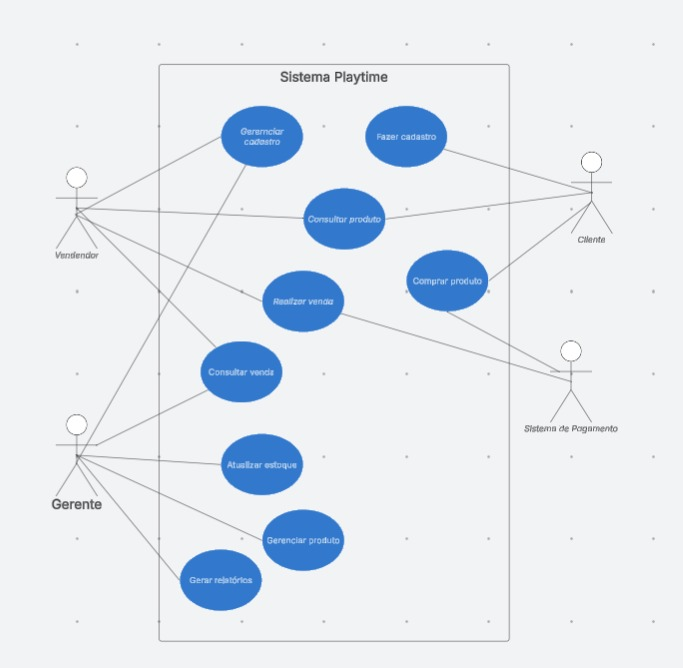
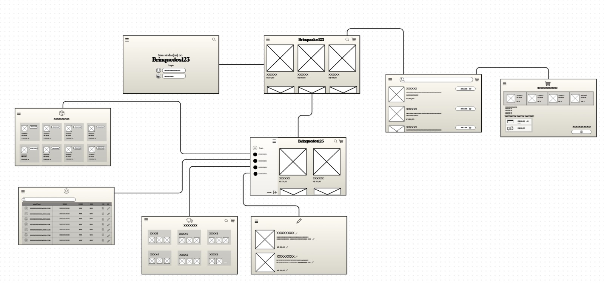

<div align="center">

#  **Playtime**
### Sistema para Lojas de Brinquedos

---

##  **Sobre o Projeto**

O **Playtime** é um sistema web desenvolvido para gerenciar lojas de brinquedos, permitindo que clientes comprem produtos, vendedores realizem vendas e gerentes controlem estoque e relatórios.

---

##  **Atores do Sistema**

|    Ator |  Funcionalidades |
|---------|---------------------|
|  **Cliente** | Consultar produtos · Realizar cadastro · Comprar produtos |
|  **Vendedor** | Gerenciar cadastro · Consultar produtos · Realizar vendas · Consultar vendas |
|  **Gerente** | Atualizar estoque · Gerenciar produtos · Gerar relatórios · Consultar vendas |
|  **Sistema de Pagamento** | Processamento externo de transações financeiras |

---

##  **Casos de Uso (versão inicial)**




| # | Caso de Uso | Atores |
|---|-------------|--------|
| 1 | Consultar produto | Cliente, Vendedor |
| 2 | Comprar produto | Cliente |
| 3 | Realizar venda | Vendedor |
| 4 | Atualizar estoque | Gerente |
| 5 | Gerenciar produto | Gerente |
| 6 | Fazer cadastro | Cliente |

---


##  **FIGMA**



---

##  **Tecnologias Utilizadas**

<div align="center">

| Categoria | Tecnologias |
|-----------|-------------|
| **Front-end** | Next.js · TypeScript · JavaScript |
| **Versionamento** | Git · GitHub |
| **Prototipação** | Figma |

</div>

---

## **Páginas Implementadas**

|  Rota |  Página |  Descrição |
|---------|-----------|--------------|
| `/login` | Login | Acesso para usuários |
| `/menu` | Menu Principal | Navegação entre todas as funcionalidades |
| `/pesquisa` | Pesquisar Produtos | Busca e visualização de produtos |
| `/compra` | Finalizar Compra | Carrinho e simulação de compra |
| `/estoque` | Gestão de Estoque | Gerente atualiza quantidades dos produtos |
| `/produto` | Gerenciar Produtos | CRUD básico de produtos |

---

## **Como Executar o Projeto**

 Passo a passo

```bash
npm install

cd playtime

npm run dev

```

Abra [http://localhost:3000](http://localhost:3000) com seu browser para ver o resultado.

